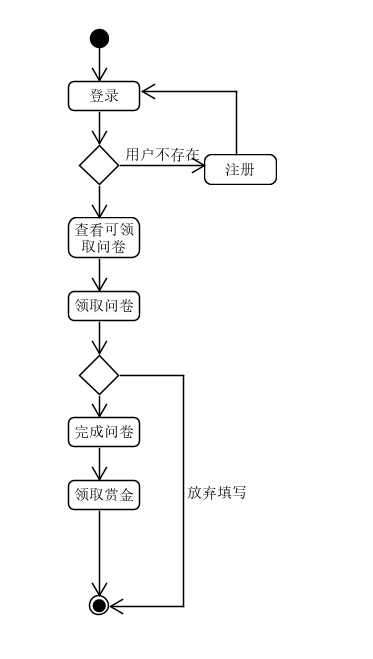

## 用例图

  

---
---
 - 用例编号：01    
 - 用例名称：修改个人信息   
 - 简要说明：该用例描述用户如何修改其个人信息，包括昵称、头像等   
 - 参与者：用户  
 - 前置条件：用户登录该系统  
 - 后置条件：用户个人信息修改  
 - 触发事件：用户选择修改个人信息按钮开始该用例。 基本流：  
   1.	用户选择“修改个人信息“操作  
   2.	用户按表格填入新的个人信息  
   3.	用户选择“保存”操作，系统更新学生个人信息   
 - 备选流： 用户选择“取消”操作。  
 - 成功场景：基本流，系统更新个人信息  
 - 失败场景：备选流  
   
---
 - 用例编号：02   
 - 用例名称：发布问卷 
 - 简要说明：该用例描述用户如何发布其问卷
 - 参与者：用户
 - 前置条件：用户登录该系统
 - 后置条件：用户发布问卷
 - 触发事件：用户选择“发布”按钮开始该用例。 基本流：
   1.	用户选择“发布“操作
   2.	用户按表格填入问卷信息
   3.	用户选择“保存”操作，系统更新，发布问卷
 - 备选流： 用户选择其他操作。
 - 成功场景：基本流，系统发布问卷
 - 失败场景：备选流
 - 拓展：
     - a. 当选填问卷人数过多时，
         - 1. 任务参与者进入候补名单
         - 2. 拒绝参与者的选填问卷
     - b. 当问卷状态改变时，
         - 1. 更新问卷信息状态，通知选填该问卷的用户
     - c. 当发布者拒绝某参与者的选填时,
         - 前置条件，问卷填写时间为开始，参与者未完成问卷
         - 1. 在参与列表中移除该用户
         - 2. 通知该用户
     - d. 当发布者需要终止问卷填写报名时，
         - 1. 关闭问卷的报名入口，问卷不再接受选填
     - e. 当参与者退出问卷选填时，
         - 1. 问卷填写时间未开始
             - 参与者退出该问卷报名列表
             - 通知发布者
         - 2. 问卷填写时间已开始
             - 参与者退出该问卷
             - 通知发布者
                      
---
 - 用例编号：03   
 - 用例名称：参与问卷 
 - 简要说明：该用例描述用户如何参与问卷填写
 - 参与者：用户
 - 前置条件：用户登录该系统
 - 后置条件：用户填写问卷
 - 触发事件：用户选择“参与”按钮开始该用例。 基本流：
   1.	用户选择“参与“操作
   2.	用户进入问卷发布广场
   3.	用户选择一份问卷，点击“参与”操作
 - 备选流： 用户选择其他操作。
 - 成功场景：基本流，用户被列入该问卷的报名表
 - 失败场景：备选流
 
---
 - 用例编号：04   
 - 用例名称：查看问卷信息 
 - 简要说明：该用例描述用户如何查看问卷信息
 - 参与者：用户
 - 前置条件：用户登录该系统
 - 后置条件：用户了解到自己参与过或发部过的或收藏过的问卷
 - 触发事件：用户选择“问卷”按钮开始该用例。 基本流：
   1.	用户选择“问卷“操作
   2.	用户进入自己问卷界面
   3.	用户分别选择“发布”、“参与”、“收藏”按钮进入不同界面
 - 备选流： 用户选择其他操作。
 - 成功场景：基本流，用户进入相应界面，得到相应信息
 - 失败场景：备选流
 
---

## 活动图

### 发布问卷：  

### 接受问卷：

