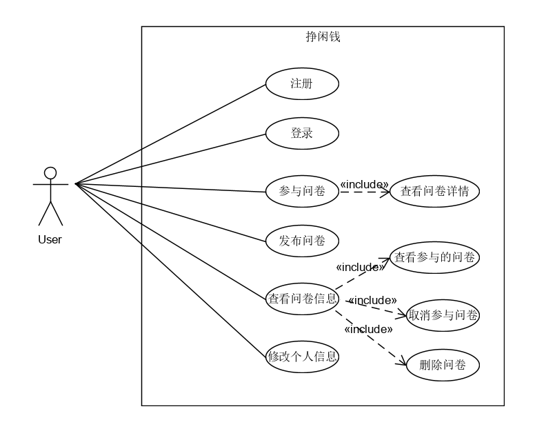

# 软件需求规格说明书

---

## 背景
    当代社会校园网已得到大范围覆盖，个人个人电脑的普及率增高，
    计算机已广泛渗透入学生生活。通过网络进行问卷填写志愿者征
    询也变成了一个新的课题。本系统可应用于大学生的问卷调差，是
    一个小型的问卷管理系统。其支持学生发布问卷和参与问卷调查
    ，其中以赏金机制推动运转，使得学生能更方便地找到问卷参与者
    及学生在空闲之余挣取闲钱。

 - 项目名称：挣闲钱
 - 开发者：项目小组成员
 - 使用者：项目小组成员、大学生
 
---
## 软件产品概述
### 系统功能
本系统旨在帮助大学生解决问卷调研参与者难寻的问题，同时帮助学生挣取赏金。主要功能：注册登录、参与问卷、发布问卷、修改个人信息、查看问卷情况。简单易操作的界面。
### 用户特征
用户可作为问卷发布者和问卷参与者：
 - 问卷发布者：选择“发布”进入发布问卷界面，填写相关信息，待审核后发布。
 - 问卷参与者：选择“参与”进入问卷广场界面，选择目标问卷，“参与”进入问卷详情界面。

---
## 功能需求
### 功能说明
    本系统主要提供大学生问卷调研平台，用户可进行问卷发布和参与。
### 用例模型

  

问题域：用户问卷发布与参与情况管理。
系统边界：用户所有功能。
执行者：用户。
---
---
 - 用例编号：01    
 - 用例名称：修改个人信息   
 - 简要说明：该用例描述用户如何修改其个人信息，包括昵称、头像等   
 - 参与者：用户  
 - 前置条件：用户登录该系统  
 - 后置条件：用户个人信息修改  
 - 触发事件：用户选择修改个人信息按钮开始该用例。 基本流：  
   1.	用户选择“修改个人信息“操作  
   2.	用户按表格填入新的个人信息  
   3.	用户选择“保存”操作，系统更新学生个人信息   
 - 备选流： 用户选择“取消”操作。  
 - 成功场景：基本流，系统更新个人信息  
 - 失败场景：备选流  
   
---
 - 用例编号：02   
 - 用例名称：发布问卷 
 - 简要说明：该用例描述用户如何发布其问卷
 - 参与者：用户
 - 前置条件：用户登录该系统
 - 后置条件：用户发布问卷
 - 触发事件：用户选择“发布”按钮开始该用例。 基本流：
   1.	用户选择“发布“操作
   2.	用户按表格填入问卷信息
   3.	用户选择“保存”操作，系统更新，发布问卷
 - 备选流： 用户选择其他操作。
 - 成功场景：基本流，系统发布问卷
 - 失败场景：备选流
 - 拓展：
     - a. 当选填问卷人数过多时，
         - 1. 任务参与者进入候补名单
         - 2. 拒绝参与者的选填问卷
     - b. 当问卷状态改变时，
         - 1. 更新问卷信息状态，通知选填该问卷的用户
     - c. 当发布者拒绝某参与者的选填时,
         - 前置条件，问卷填写时间为开始，参与者未完成问卷
         - 1. 在参与列表中移除该用户
         - 2. 通知该用户
     - d. 当发布者需要终止问卷填写报名时，
         - 1. 关闭问卷的报名入口，问卷不再接受选填
     - e. 当参与者退出问卷选填时，
         - 1. 问卷填写时间未开始
             - 参与者退出该问卷报名列表
             - 通知发布者
         - 2. 问卷填写时间已开始
             - 参与者退出该问卷
             - 通知发布者
                      
---
 - 用例编号：03   
 - 用例名称：参与问卷 
 - 简要说明：该用例描述用户如何参与问卷填写
 - 参与者：用户
 - 前置条件：用户登录该系统
 - 后置条件：用户填写问卷
 - 触发事件：用户选择“参与”按钮开始该用例。 基本流：
   1.	用户选择“参与“操作
   2.	用户进入问卷发布广场
   3.	用户选择一份问卷，点击“参与”操作
 - 备选流： 用户选择其他操作。
 - 成功场景：基本流，用户被列入该问卷的报名表
 - 失败场景：备选流
 
---
 - 用例编号：04   
 - 用例名称：查看问卷信息 
 - 简要说明：该用例描述用户如何查看问卷信息
 - 参与者：用户
 - 前置条件：用户登录该系统
 - 后置条件：用户了解到自己参与过或发部过的或收藏过的问卷
 - 触发事件：用户选择“问卷”按钮开始该用例。 基本流：
   1.	用户选择“问卷“操作
   2.	用户进入自己问卷界面
   3.	用户分别选择“发布”、“参与”、“收藏”按钮进入不同界面
 - 备选流： 用户选择其他操作。
 - 成功场景：基本流，用户进入相应界面，得到相应信息
 - 失败场景：备选流
 
---

### 用例展开————活动图

### 发布问卷：  

### 接受问卷：

## 领域模型

## 系统状态模型

## 用例顺序图

### 注册和登录顺序图：

### 修改个人信息业务顺序图：

### 发布问卷

### 参与问卷

